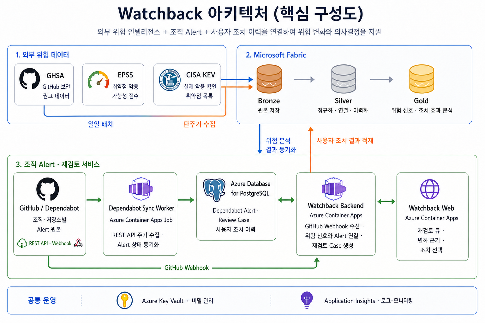

# 팀 공통 아키텍처 참고 자료

[기술 아키텍처](technical-architecture.md)는 시스템 구성·데이터 흐름·DE/DS/Web 책임 경계를 설명합니다.

이 그림은 팀 저장소의 공통 설계 자료입니다. ShinDuck의 단독 작성물로 표기하지 않습니다.

- [그림 원본](https://github.com/dt4-proj3-team3/watchback/blob/505d3b3c48f014a4f01f83bdcdc70bee92fa3809/docs/architecture/arch-overview.png)
- 확인/이관: 2026-09-21. 그림 내용은 수정하지 않았습니다.
- 그림은 설계 개요이며 전체 기능의 구현·배포 완료를 의미하지 않습니다.
- [제품 요구사항](../product/prd.md) · [개인 DS 기여](../contributions/ds-issues-and-deliverables.md)
